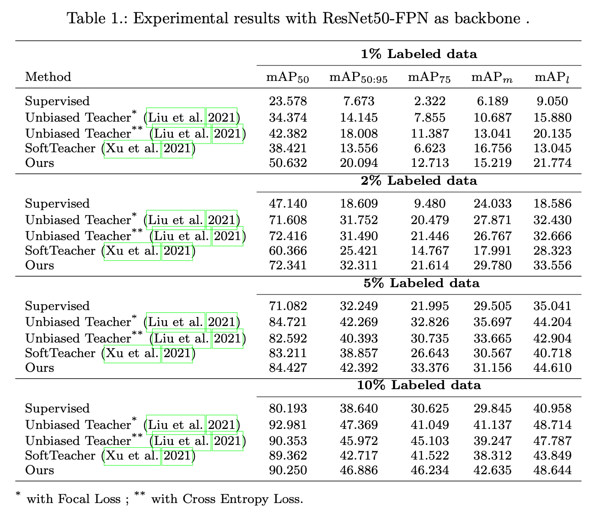
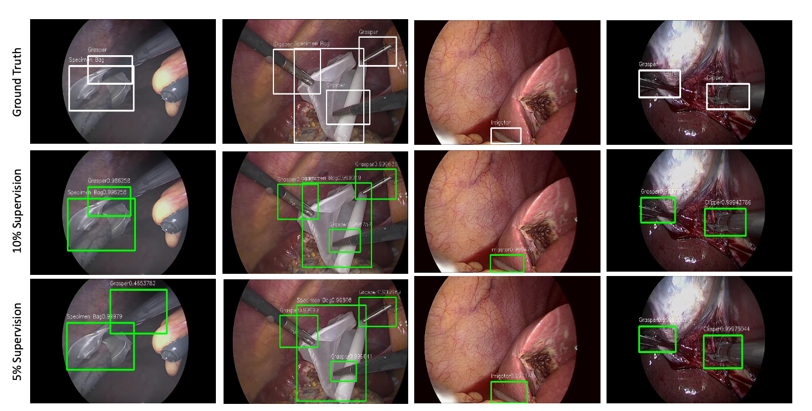

# Semi-supervised-surgical-tool-detection
This repository contains code for our paper titled "A semi-supervised teacher-student framework for surgical tool detection and localization"

in this paper we introduce a semi-supervised learning (SSL) framework in surgical tool detection paradigm which aims to mitigate the scarcity of training data and the data imbalance through a knowledge distillation approach. In our framework, we train a model with labeled data which initialises the teacher-student joint learning, where the student is trained on teacher-generated pseudo labels from unlabeled data. We propose a multi-class distance with a margin based classification loss function in the region-of-interest head of the detector to effectively segregate foreground classes from background region


## Results




## Dataset Download 
m2cai16-tool locations dataset can be downloaded [here](https://ai.stanford.edu/~syyeung/tooldetection.html)
Dataset annotations are in VOC format. However, this work uses coco format. All the required code files for voc to coco conversion can be found in data folder. 

## Installation
### Build Environment 
 ```sh
 # create conda env
 conda create -n tool python=3.6 
 # activate the enviorment 
 conda activate tool
 # install PyTorch >=1.5 with GPU 
 conda install pytorch torchvision -c pytorch 
 # install detectron2 
 https://github.com/facebookresearch/detectron2/blob/main/INSTALL.md   
   ```


## Training 
* To train the network use following. <br />
`CUDA_VISIBLE_DEVICES =1,2 python train_net.py` \ <br /> `--num-gpus 2` \ <br />`--config configs/coco_supervision/faster_rcnn_R_50_FPN_sup1_run1.yaml\`<br />`SOLVER.IMG_PER_BATCH_LABEL 4 SOLVER.IMG_PER_BATCH_UNLABEL 4` <br />

* Just change the config file to train on different percentages of labeled set. <br />

## Evaluation
* To evaluate the model, use the checkpoint. <br />
`CUDA_VISIBLE_DEVICES =1,2 python train_net.py` \ <br />  `--eval-only` \ <br />  `--num-gpus 2` \ <br />`--config configs/coco_supervision/faster_rcnn_R_50_FPN_sup1_run1.yaml\`<br />`SOLVER.IMG_PER_BATCH_LABEL 4 SOLVER.IMG_PER_BATCH_UNLABEL 4` \ <br /> 
`MODEL.WEIGHTS path_to_checkpoint/checkpoint` 

## Model weights
Download checkpoint [here](https://drive.google.com/file/d/1CrS4oKPWZAlAJh1m1NzyuB4019r_-GvP/view?usp=sharing)
| Backbone  | Supervision       |  Batch Size                | mAP_50:95      |  Model Weights       |
| ------------- | ------------- | -------------              |  ------------- |   -------------      |
| ResNet50-FPN  | 1%            | 4 labeled + 4 unlabeled    |                |                      |
| ResNet50-FPN  | 2%            | 4 labeled + 4 unlabeled    |                |                      |
| ResNet50-FPN  | 5%            | 4 labeled + 4 unlabeled    |                |                      |
| ResNet50-FPN  | 10%           | 4 labeled + 4 unlabeled    |                |                      |


## Citing semi-supervised tool detection
